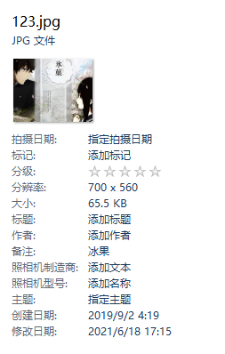

## 通过全局热键来控制 ffmpeg 录屏，并转成高质量动图 webp 探索
  - 想法延伸： 在转成成 webp 的时候对 Windows Explorer 的分组功能做了一个探索
    - 通过下面显示 `备注` 的值可做分组依据

|||
| -- | -- |
|||

  - Conclusion
    - 核心
      - [Use PowerShell to edit a file's metadata (Details tab of a file in Windows file explorer)](https://stackoverflow.com/questions/64597009/use-powershell-to-edit-a-files-metadata-details-tab-of-a-file-in-windows-file)
      - [pscon.py](https://github.com/SublimeText/Pywin32/blob/master/lib/x64/win32comext/propsys/pscon.py)
      - [PyIPropertyStore.cpp](https://github.com/mhammond/pywin32/blob/master/com/win32comext/propsys/src/PyIPropertyStore.cpp)
      - [Reading and writing Windows “tags” with Python 3](https://stackoverflow.com/questions/61713787/reading-and-writing-windows-tags-with-python-3)
      - [Guide to editing file metadata using PowerShell](https://abdus.dev/posts/powershell-file-metadata-guide/)
    - 添加新的扩展文件属性
      - [Add-ExtendedFileProperties.ps1](https://resources.oreilly.com/examples/9780596528492/blob/master/Add-ExtendedFileProperties.ps1)
    - linux mac,(未细探索)
      - [xattr](https://github.com/xattr/xattr)
    
  - Reference
    - [taglib-sharp](https://github.com/mono/taglib-sharp)
    - [TagLib Audio Meta-Data Library](https://taglib.org/)
    - [itext7-dotnet](https://github.com/itext/itext7-dotnet) (pdf)

